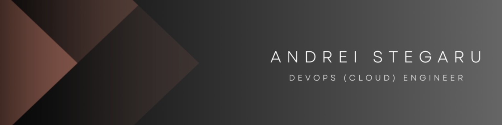

<div style="text-align: center;">
  
</div>


## ❖ About Me

I am a passionate DevOps Engineer with expertise in Kubernetes, Docker, Terraform, Golang, Ansible, and more. I have experience in cloud infrastructure automation, maintenance, troubleshooting, security and system administration.

Some of my work experience includes:
**DevOps Engineer@TKD Solutions Gmbh (currently)**, Cloud Engineer @IONOS SE Berlin.

---

## 💫 Certifications
- CKS: Certified Kubernetes Security Specialist (The Linux Foundation 2023)
- CKA: Certified Kubernetes Administrator (The Linux Foundation, 2022)
- PCA: Prometheus Certified Associate (The Linux Foundation, 2023)
- PCAP 31-03: Certified Associate in Python Programming (Python Institute 2023)
- HashiCorp Certified: Terraform Associate (HashiCorp, 2022)
- LPIC1: Linux Professional Institute (LPI, 2022)
- DF01: MongoDB Developer Training (MongoDB University 2023)
- DF300: MongoDB Design Skills / Advanced Features (MongoDB University 2023)

---

## ⚙️ Tech Stack
```yaml
DevOps/IaaC: Kubernetes, Terraform, Ansible, Docker, Grafana, CloudInit, Vagrant
Operating Systems: Linux (Debian, Ubuntu, Redhat, CentOS, Kali, Alpine), MacOS
Scripting/Programming: Python, Golang, C++, Unix Shell Scripting, YAML
Virtualization: KVM, vSphere, HyperV, VirtualBox
Cloud Providers: Azure, IONOS, Hetzner, AWS, GCP
CI/CD: GitLab, GitHub, Jenkins, Azure DevOps
Databases: MongoDB, MySQL, MariaDB, PostgreSQL
Networking: OpenVPN, pfSense, IoT, Routing, HTTP/S
```
---

## ✨ Education

- Master in Composition and Electronic Music, Staatlichen Hochschule für Musik und Darstellende Kunst Stgt.
- Bachelor in Composition and Electronic Music, Hochschule für Musik Bukarest

---

## 🚀 Projects

### Sound Design Programming
- Psychoacoustic and Acoustic Research with IRCAM Software.
- Computer-aided Composition (CAC) and Computer-generated Composition (CGC) with IRCAM Software.

---

## ✉️ Contact

- Email: andrei-stegaru@gmx.de
- Location: Berlin, Germany

[](https://www.linkedin.com/in/andrei-stegaru-0143a9152/)
[](https://github.com/a1010s)
[](https://yourportfolio.com)

<p align="center">
 
</p>

<!--
**a1010s/a1010s** is a ✨ _special_ ✨ repository because its `README.md` (this file) appears on your GitHub profile.

Here are some ideas to get you started:

- 🔭 I’m currently working on ...
- 🌱 I’m currently learning ...
- 👯 I’m looking to collaborate on ...
- 🤔 I’m looking for help with ...
- 💬 Ask me about ...
- 📫 How to reach me: ...
- 😄 Pronouns: ...
- ⚡ Fun fact: ...
-->
